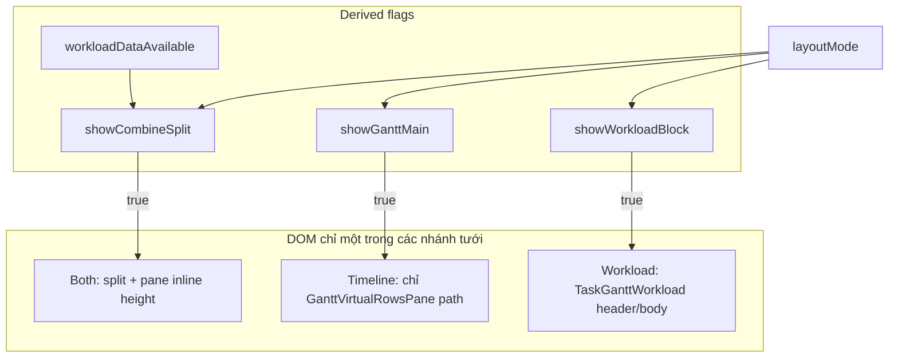

# Gantt layout modes + sửa mất dữ liệu / height (không hủy tối ưu hiện có)

## Phân tích sâu: hai bảng hoạt động thế nào

Phần này mô tả **luồng thật trong code** ([TaskGanttView.tsx](d:/git_personal/honey-badger/src/renderer/pages/taskmanagement/TaskGanttView.tsx), [TaskGanttWorkload.tsx](d:/git_personal/honey-badger/src/renderer/pages/taskmanagement/TaskGanttWorkload.tsx)) để mọi thay đổi layout không phá invariant → tránh bug “mất bảng” / height.

### A. TaskGanttView — Gantt không phải một `<table>`: pipeline dữ liệu + virtual list + lớp nền

1. **Chuẩn hóa dữ liệu:** `tasks` → `scheduled` / `unscheduled` (theo `planStartDate` / `planEndDate` / milestone). Chỉ `scheduled` đi vào timeline.
2. **Nhóm & cây:** `bucketGanttScheduled` → `groupTrees` (roots, `childrenMap`), có `depSortTasks(..., taskLinks)` để hàng liên quan dependency đứng cạnh nhau.
3. **Danh sách phẳng duy nhất cho UI và geometry:** `buildGanttVirtualFlatRows` → `ganttVirtualFlatRows` (hàng header nhóm + hàng task). Cùng danh sách này dùng để:
   - tính `ganttBodyScrollHeightPx` / `ganttChartIdealHeightPx` (chiều cao sheet + **input** cho split pane Both qua `ganttChartIdealHeightPxRef`);
   - tính `taskRowTopPx` cho **SVG dependency** (`arrowPaths`).
4. **Khối body trong `renderGanttPanelBody`:** Một `div` “sheet” có `data-gantt-grid`, `minHeight: totalBodyPx` (~2237+), bọc:
   - **`GanttBodyChartLayers` (memo):** weekend, `GanttTimelineGridOverlay`, `arrowPaths`, today — **position absolute**, `pointer-events-none`, z-index cố định; phải khớp `chartWidth` / `totalBodyPx` với vùng hàng.
   - **`GanttVirtualRowsPane`:** `@tanstack/react-virtual` với `getScrollElement: () => scrollRef.current`; **`scrollRef` = `ganttScrollRef`** gắn trên `div` scroll body (~2230). Chỉ các hàng trong viewport được mount; mỗi hàng gọi `renderGanttVirtualRowSlice` → `GanttTaskRow` / milestone / unscheduled (`rowSegment` meta | chart).

**Điểm nhạy cảm (nguyên nhân “mất data”):** Virtualizer **phụ thuộc** DOM scroll đã mount và có kích thước hợp lệ. Nếu sau đổi layout cha bị `height: 0`, `minHeight` chưa commit, hoặc `scrollRef.current` null trong một nhịp, có thể **0 virtual item** hiển thị cho đến khi scroll/resize. **Không** được nhúc `useVirtualizer` lên `TaskGanttView`.

### B. TaskGanttWorkload — bảng theo project/user, không virtual, có thể hai mount

1. **Không virtualize hàng:** `displaySegments` → từng `WorkloadProjectSegmentPanel` render đủ lưới bucket theo `scale` / `totalDays` / `pixelPerDay`.
2. **`segment`:** `header` (meta + strip timeline + `headerTimelineTrackRef`), `body` (nội dung), `full` (gộp). Khi có segment thật và **tách scroll dọc** (workload split trong parent): **hai instance** `TaskGanttWorkload` + `displayMode` controlled — đây là **thiết kế cố ý** (tránh sticky subpixel Chrome), không được gộp một mount nếu vẫn cần header cố định ngoài `overflow-y`.
3. **Căn cột với Gantt:** `leftBlockWidthPx`, `hbGantt.sheet(chartWidth)`, overlay — phải cùng contract với parent (`workloadSharedProps`).
4. **Mini-Gantt trong hàng expand:** `renderMiniGanttForUser` từ parent; parent giữ **ref + invoker** (`renderMiniGanttForUserRef`, ~1233–1237, ~1759–1762) để `memo(TaskGanttWorkload)` không bị invalidate mỗi render.

**Hệ quả mode Workload-only:** Không cần mount `renderGanttPanelBody`, nhưng vẫn cần `scheduled` + invoker đúng để mini-Gantt hoạt động; state expand hàng nằm **trong** `TaskGanttWorkload` — đổi mode unmount sẽ **mất expand** (chấp nhận được trừ khi sau này lift state).

### C. Both (split) — ghép hai hệ qua chiều cao imperative + scroll ngang

- Shell: `ganttWorkloadSplitRef` + `ResizeObserver` → `ganttWorkloadSplitShellH`.
- Pane Gantt trên: `ganttWorkloadPaneRef` nhận **`style.height` / `style.maxHeight`** từ `commitGanttWorkloadPaneLayoutDom` (~1814–1825), không qua React state — **dễ sót cleanup** khi chuyển sang Timeline full-height hoặc Workload full-height.
- Đồng bộ ngang: listeners `passive` trên `ganttScrollRef` / `workloadScrollRef`, `syncHorizontalScrollFrom`, `applyTimelineTransforms` trên hai header.

### D. Bất biến bắt buộc khi thêm `layoutMode` (vi phạm = bug)

| Invariant | Ghi chú |
|-----------|---------|
| Khi `showCombineSplit`, DOM + class overflow của body Gantt trong split **giống** nhánh `{showWorkload ? …}` hiện tại | Chỉ đổi điều kiện boolean, không bọc thêm lớp quanh `GanttVirtualRowsPane` / sheet. |
| `ganttVirtualFlatRows` → `taskRowTopPx` / `ganttBodyScrollHeightPx` / `GanttVirtualRowsPane` dùng cùng nguồn `scheduled` + cây | Tránh mũi tên lệch hoặc `minHeight` sai. |
| Virtualizer luôn có `getScrollElement` trỏ DOM scroll **đang tồn tại** | Sau remount mode: `useLayoutEffect` gọi `measure` (TanStack) hoặc chiến lược key/restore scroll **có kiểm soát** — ưu tiên không `key` mỗi render. |
| `scrollToChartPixel` / effect sync ~1961 dùng đúng element scroll **theo mode** | Both|Timeline: `ganttScrollRef`; Workload-only: `workloadScrollRef`; sau đó `applyTimelineTransforms(sl)`. |
| Thoát `showCombineSplit` → xóa inline `height`/`maxHeight` trên pane (nếu ref còn) | Không để flex con bị khóa chiều cao cũ. |
| ResizeObserver / commit pane / drag split chỉ theo `showCombineSplit` | Tránh RO trên shell không mount; tránh commit khi chỉ Timeline nhưng `workloadLoading` vẫn true. |
| Listener workload chỉ khi `showWorkloadBlock` | Không đăng ký scroll lên ref null / unmounted. |

## Mục tiêu

- Cho phép ba chế độ: **Timeline (chỉ Gantt)**, **Workload (chỉ workload)**, **Both** (split như hiện tại khi có dữ liệu workload), với toggle toolbar **cùng style Zoom**, đặt **trước** nhóm Zoom trong [TaskGanttView.tsx](d:/git_personal/honey-badger/src/renderer/pages/taskmanagement/TaskGanttView.tsx).
- Sửa triệt để: **mất bảng Gantt sau đổi mode**, **chiều cao không full** khi rời Both hoặc vào lại Both.
- **Không** làm suy giảm các tối ưu đang có; **không bắt buộc** tách file.

## Checklist bảo vệ performance (không được phá)

Các phần sau **chỉ được tái sử dụng / giữ nguyên cấu trúc**, không gộp virtualizer lên parent, không bỏ `memo`/`useMemo` cốt lõi:

| Tối ưu hiện có | Vị trí / ý nghĩa |
|----------------|------------------|
| `GanttVirtualRowsPane` + `useVirtualizer` | [TaskGanttView.tsx](d:/git_personal/honey-badger/src/renderer/pages/taskmanagement/TaskGanttView.tsx) ~993–1006 — virtualizer **phải** ở component con, `getScrollElement: () => scrollRef.current`. |
| `memo` trên hàng / layer | `GanttTaskRow`, `GanttBodyChartLayers`, `TaskGanttWorkload`, v.v. |
| CSS variables `hbGanttRootStyle` / `hbGantt` | [ganttLayoutCssVars.ts](d:/git_personal/honey-badger/src/renderer/pages/taskmanagement/ganttLayoutCssVars.ts) — rail meta / lưới không đổi. |
| Scroll ngang: `passive`, dedup `ganttLastScrollLeftSeenRef` / `workloadLastScrollLeftSeenRef` | ~1731–1756. |
| `renderMiniGanttForUserRef` + invoker | ~1759–1762, 1233–1237 — giữ identity cho Workload `memo`. |
| `startTransition` cho grid/actual bars | ~1160–1171 — giữ. |

**Luồng baseline:** Khi `layoutMode === 'combine'` và `workloadDataAvailable` (có segment hoặc `workloadLoading`), DOM và class overflow của body Gantt trong split phải **giống hành vi hiện tại** của nhánh `{showWorkload ? split : gantt}` — chỉ thay điều kiện từ `showWorkload` sang cờ tổ hợp tương đương (`showCombineSplit`), không thêm wrapper cha mới quanh toàn bộ virtual rows.

## Mapping triệu chứng → invariant (tham chiếu mục D)

| Triệu chứng | Nguyên nhân kỹ thuật | Hành động trong code |
|---------------|----------------------|------------------------|
| Hàng Gantt biến mất sau đổi mode | Virtualizer + scroll container / `minHeight` (A, D) | `showCombineSplit` cho overflow; sau remount `measure` hoặc sync layout; không bọc sheet thêm lớp flex sai. |
| Height không full sau Both | Inline style pane (C, D) | `removeProperty('height'|'max-height')` khi `!showCombineSplit`; commit/RO chỉ khi `showCombineSplit`. |
| Fit/Today không tác dụng (Workload-only) | `scrollToChartPixel` chỉ `ganttScrollRef` | Active element theo mode (D). |
| Strip timeline workload không dịch | `useLayoutEffect` ~1961 thiếu nhánh khi không có `g` | Đọc `workloadScrollRef` khi chỉ Workload (D). |
| RO / commit chạy khi không có split | `showWorkload` vs có DOM | RO/commit/drag chỉ `showCombineSplit`; scroll listener workload chỉ `showWorkloadBlock`. |

## Thiết kế state

- `export type TaskGanttLayoutMode = 'gantt' | 'workload' | 'combine'`.
- `workloadDataAvailable` = hiện tại `showWorkload` (loading hoặc `segments.length > 0`).
- `showCombineSplit` = `layoutMode === 'combine' && workloadDataAvailable`.
- `showGanttMain` = `layoutMode !== 'workload'`.
- `showWorkloadBlock` = `layoutMode !== 'gantt' && workloadDataAvailable`.
- `localStorage` key (vd. `honey_badger.taskGantt.layoutMode.v1`), default **`combine`** để khi có workload, hành vi mặc định = **y như hiện tại**.

Toolbar: `ToggleGroup` trước `labels.zoom`; Workload + Combine `disabled` khi `!workloadDataAvailable`. i18n + [TaskGanttViewLabels](d:/git_personal/honey-badger/src/renderer/pages/taskmanagement/TaskGanttView.tsx) + truyền từ [TaskManagement.tsx](d:/git_personal/honey-badger/src/renderer/pages/taskmanagement/TaskManagement.tsx) / [translation.json](d:/git_personal/honey-badger/src/renderer/locales/en/translation.json) (en/ja/vi).

## Cấu trúc render vùng board (~2415–2463)

- **Both + data:** giữ cấu trúc hiện tại (`ganttWorkloadSplitRef` → pane → handle → workload).
- **Timeline:** một `div` `flex min-h-0 flex-1 flex-col overflow-hidden` bọc `renderGanttPanelBody()` — **không** mount `TaskGanttWorkload`.
- **Workload + data:** một cột `flex-1` với cùng nhánh `workloadSplitScroll` / `full` như hiện tại.
- **Workload + !data:** placeholder ngắn (một `TaskGanttWorkload` empty hoặc text), không mount bảng nặng nếu không cần.

## Thứ tự triển khai đề xuất

1. Thêm type + LS + derived flags; thay điều kiện `renderGanttPanelBody` (`showWorkload` → `showCombineSplit` cho overflow).
2. Tách nhánh JSX board theo `showGanttMain` / `showWorkloadBlock` / `showCombineSplit`.
3. Cleanup inline style pane khi `!showCombineSplit`; siết `useLayoutEffect` commit pane chỉ khi `showCombineSplit`.
4. `scrollToChartPixel` + `useLayoutEffect` sync (~1961) theo active scroll element.
5. Xử lý virtualizer sau đổi mode (measure hoặc key có kiểm soát + optional restore scroll) — **sau** bước 2–3 để DOM scroll đã đúng kích thước (mục A).
6. **Kiểm thử theo invariant mục D:** (1) Both + workload: DOM/overflow/scroll đồng bộ như trước khi có `layoutMode`. (2) Vòng Timeline ↔ Workload ↔ Both ×3: không mất hàng, full height. (3) Fit/Today trên từng mode. (4) Kéo split chỉ Both. (5) Meta rail + mini-Gantt expand trên Workload-only.

## Phạm vi không làm (trừ khi bạn yêu cầu sau)

- Virtualize toàn bộ [TaskGanttWorkload.tsx](d:/git_personal/honey-badger/src/renderer/pages/taskmanagement/TaskGanttWorkload.tsx).
- Refactor lớn `renderGanttPanelBody` thành nhiều file (optional sau).
